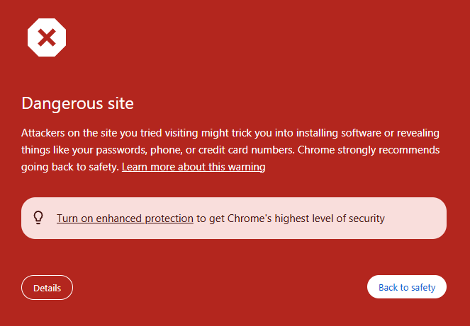
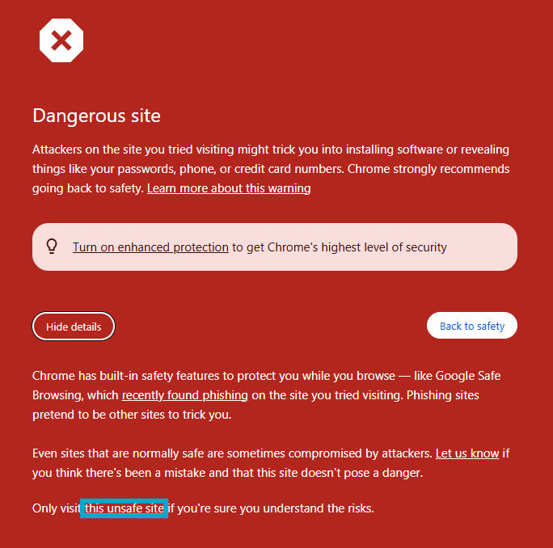

# 🚀 Pixel Plus Hackathon 2025 Submission

Welcome to my submission for the **Pixel Plus Hackathon 2025**.
The goal of this hackathon is to **replicate a website to pixel-perfect detail** and **add a unique enhancement** to improve its functionality or experience.

---

## 📌 Project Overview

### First Project

- **Original Website Replicated:** Robinhood
- **Live Demo:** [Robinhood Clone](https://robinhood-clone-project.netlify.app/robinhood-clone/)
- **Enhancement Added:** Fixed visual inconsistencies found in the original website
- **Tech Stack:** HTML, CSS, JAVASCRIPT

---

## 📂 Project Structure

-  `/robinhood-clone/`
-  `/screenshots/`

---

## 🚧 Google Safe Browsing Warning

> **Note:** Since this is a **pixel-perfect clone** of an existing website (as per the [Pixel Plus Hackathon](https://form.typeform.com/to/lJqN5mmS) rules), Google Safe Browsing may flag this site as "unsafe" or "deceptive".

This warning appears because the visual layout closely resembles a real company's landing page, which automated systems may interpret as phishing.

---

### ✅ How to Safely Bypass the Warning

If you're trying to view the deployed demo and encounter a red screen like this:

You can still proceed to view the project:

1. Click **"Details"** at the bottom left of the warning page.
2. Then click **"visit this unsafe site"** (or similar wording).
3. You’ll be taken to the deployed clone project.

---

### ⚠️ Why This Happens

This is a **frontend-only project** for educational/demo purposes and contains **no real functionality**, **login**, or **data collection**. It was created solely for submission to the Pixel Plus Hackathon and follows their requirement to replicate a site’s layout with pixel accuracy and add enhancements.
